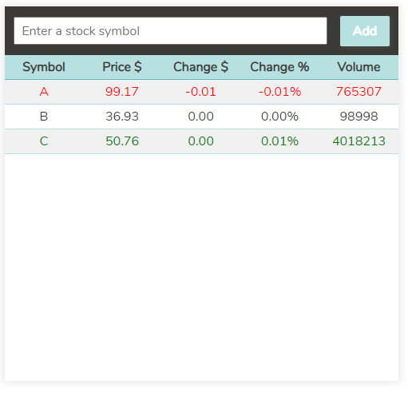

# Stock Watch List application
Stock Watch List application is written in [React](https://reactjs.org/) using React Hooks (for demonstration purpose only).

The application is located on [my portfolio website](https://daisukenakano.com/index.php#spa).

The source codes are located in the **src** directory:
* **src/StockWatchListApp/** - Contains source files used to create the stock watch list application.
  * **index.jsx** - Entry point of the application.
  * **components/** - React components written in JSX that create the application.
  * **stylesheets/** - Sass stylesheet to style the application.
  * **utils/** - JavaScript utility functions used in the application.
* **src/components/** - Generic components (i.e. error message popup, dialog popup, etc.) used in the application.
* **src/stylesheets/** - Sass stylesheet used globally amongst all applications.
* **src/utils/** - JavaScript utility functions used globally amongst all applications.

Technologies used: **Babel, ESLint, JavaScript (ES6+), JSX, PostCSS, React, Sass, stylelint, webpack**

If you have any questions or comments, please contact me. Thanks for looking!
